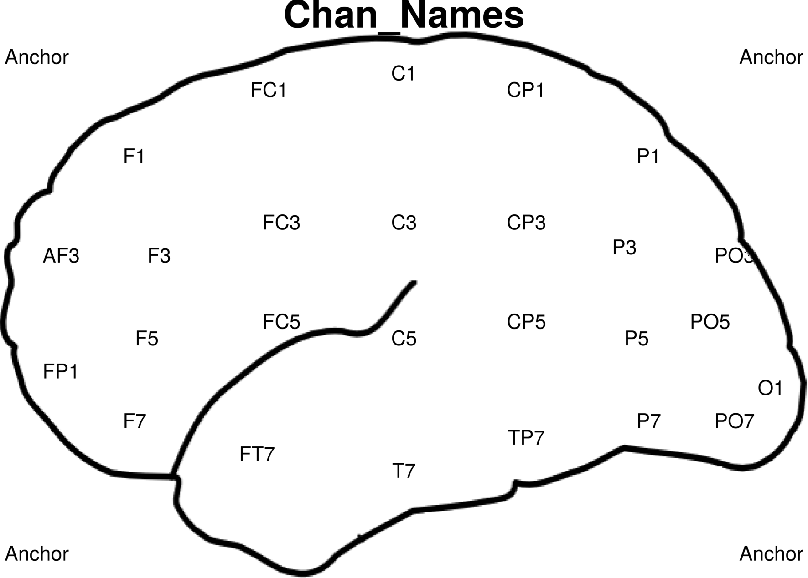
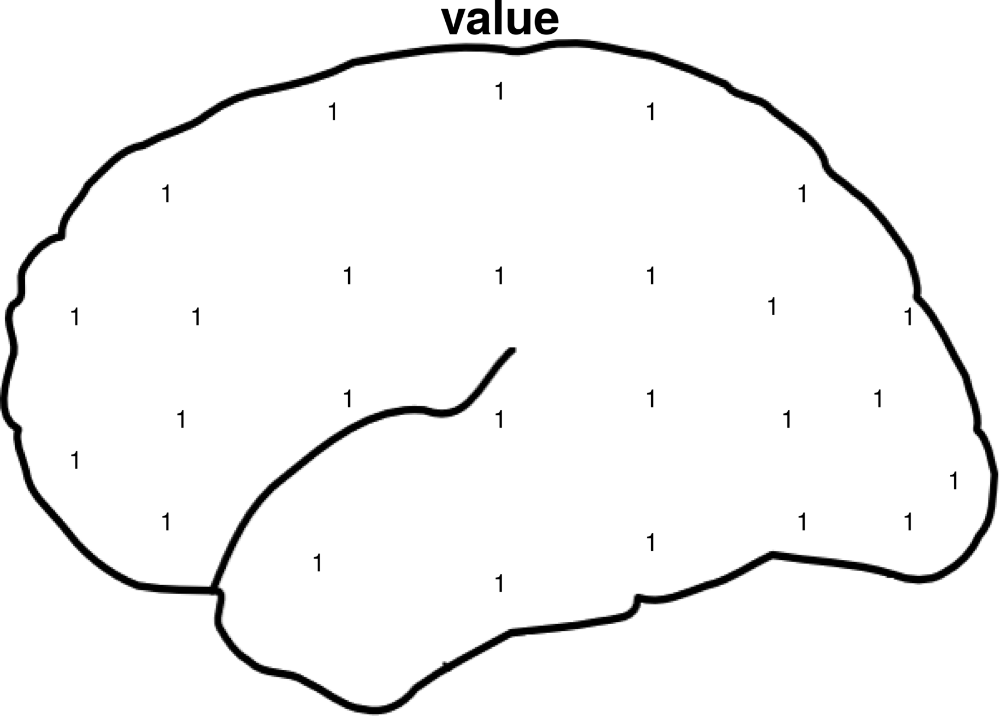
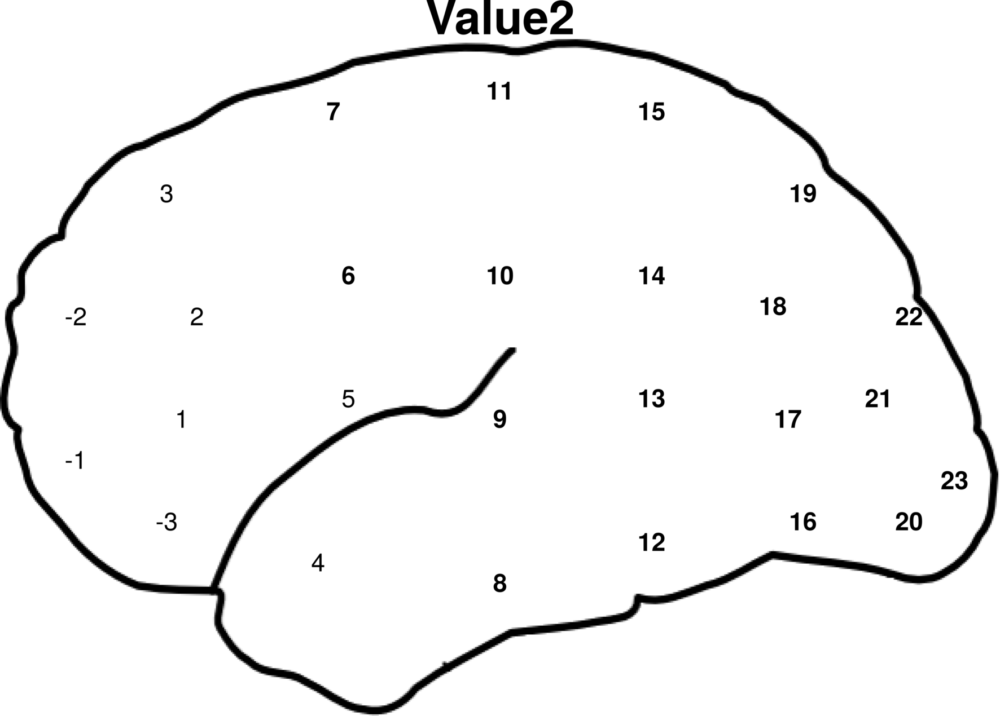

# Draw half-head R Code. 

This is the code for drawing  half head pictures with data list on locations of channels.

## Contact:
Diheng Zhang (dihengzhang@email.arizona.edu)
02/07/2020

## Default files:
.

├── draw_half_brain.R

├── figures

│   ├── Chan_Names-half-head.png

│   ├── Value2-half-head.png

│   └── value-half-head.png

├── half-head-transparent.png

├── plot.csv

└── ReadMe.MD

## Required files:
| File name | Description |
| --------- | ----------- |
|half-head-transparent.png | The background head outline|
|plot.csv                  | The CSV file includes both the x,y coordinates and the data to be plotted.|

## Required libraries:
ggplot2
dplyr
png
ggpubr

## Variables for setting
|Variables| Description|
|------|------|
|cutoff | For bold font option. Any numeric number larger than cutoff will be bold. To avoid bold font, set it to be an extremely large number.|
|output_dir | output picture directory|
|working_dir | Working directory|

## Usage:
To plot a new half-head pic, add a new column to the plot.csv file, with the title of the pic as the column name. Then insert the numeric data or character data into the rows that are corresponding to their channel locations. Save the plot.csv and run the draw_half_brain.R file and you will get output in the format of "[column_name]-half-head.png". Examples of plot.csv and outputs are available in the same folder. It supports bash outputs with multiple columns.

## Examples:

